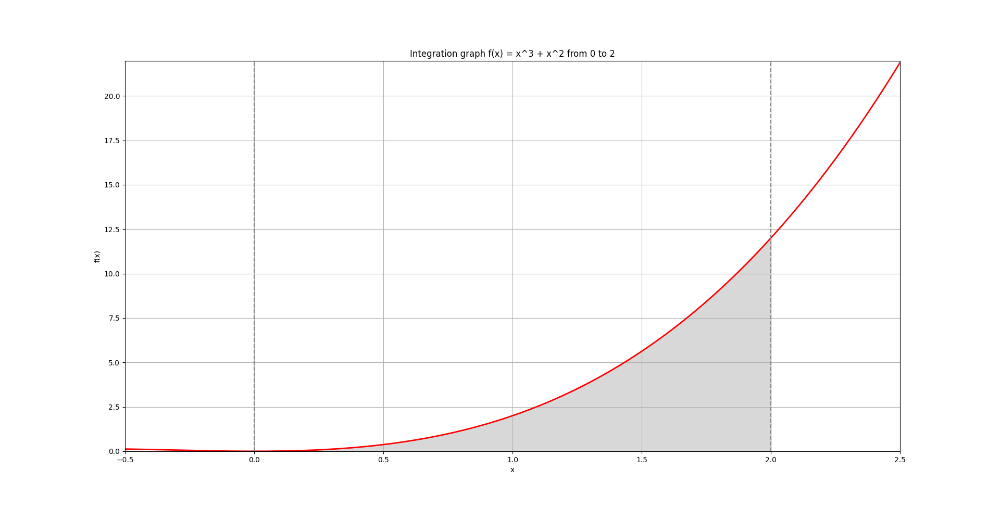
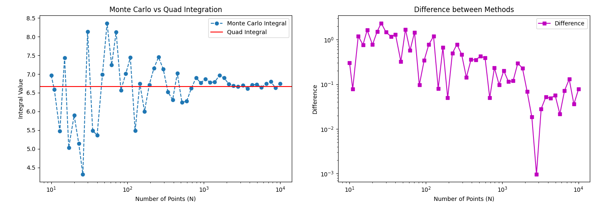

# Comparision: Monte Carlo vs Quad Integration

## Integration graph

```
python integration_graph.py
```



## Comparison methods

```
python monte_carlo_integral.py
```



## Conclusions from the Comparison of Monte Carlo and Quad Integration Methods

### [EN]

The Monte Carlo estimate fluctuates significantly for small values of N but improves as N increases since Monte Carlo integration is based on random sampling.

Use of the Monte Carlo Method:

-   Although the method is inefficient for low-dimensional problems, it is useful for high-dimensional integrals where traditional numerical methods become impractical (e.g., in physics simulations and Bayesian inference).
-   Its accuracy improves with parallel computations, making it suitable for large-scale calculations.

### [UA]

Оцінка методом Монте-Карло значно коливається при малих значеннях N, але покращується зі збільшенням N, оскільки інтегрування Монте-Карло ґрунтується на випадковій вибірці.

Використання методу Монте-Карло:

-   Хоча метод неефективний для задач малої розмірності, він корисний у випадку високорозмірних інтегралів, де традиційні чисельні методи стають непрактичними (наприклад, у фізичних симуляціях, баєсівському висновку).
-   Його точність покращується при паралельних обчисленнях, що робить його придатним для масштабних розрахунків.
